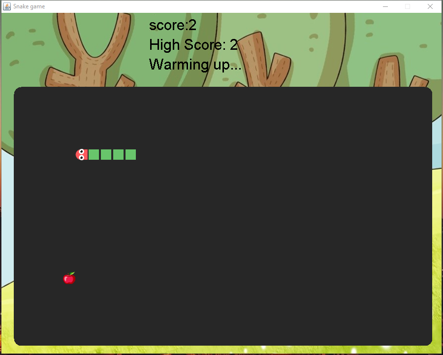
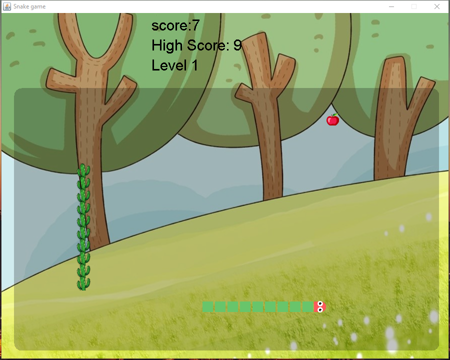
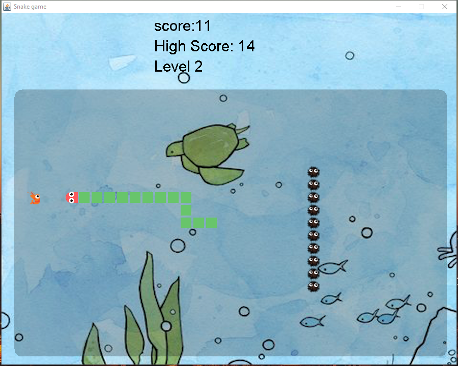
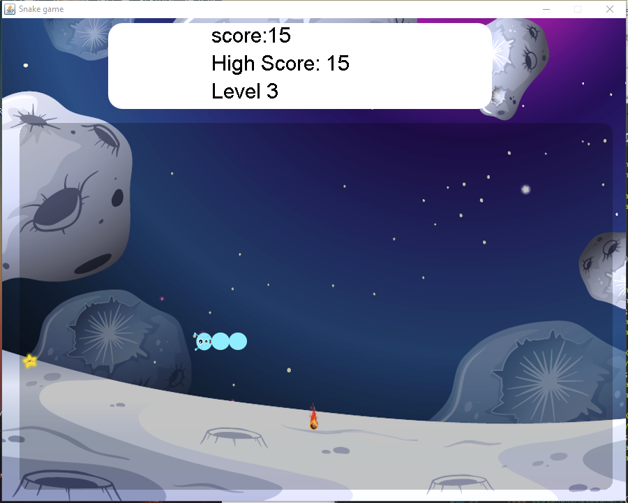
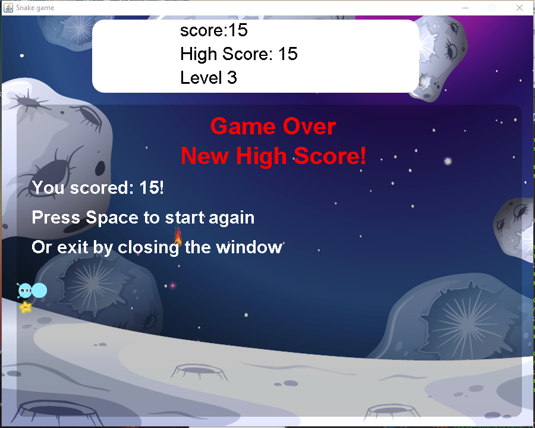

# final-project-team-83-snake
final-project-team-83-snake created by GitHub Classroom

* The game starts in a warm up session every time a new session of the program is run. It is the classic Snake (with cute adorable UI). Users control the moving snake with arrows key. Users keying in the opposite direction to the snake's current moving direction (for example keying down arrow when the snake is going up) is handled as user error and won't result in direction change.

* The new born baby snake has length of 3. Each apple is +1 in score. Every time the snake eats an apple, its body length increases by 1. 

* The current level, current score and the highest score are shown on top of the gaming area for easy reference.

* Game is over when snake's head hits the boundary. 

* When 5<= score < 10, game advances to level 1, the forest.

* In level 1, there are three kinds of food: apple = 1 socre, pear = 2, peach = 3. 

* The spiky cactus are themed obstacles in this level, increasing the difficulty by a notch. 

* Game is over when snake's head hits the boundary, cactuses or itself. 

* When 10<= score < 15, game goes to level 2, the ocean.

* In level 2, there are three kinds of food. shrimp = +1 socre. crab = +2. bomb = -2.

* Bomb is designed as a bait and will randomly shows up like the actual food, but disappears if not eaten after a pre-determined short time period.

* When score drops below 10, the snake falls back into the forest for training.

* A wall of spiky sea urchins are themed obstacles in this level. 

* Game is over when snake's head hits the boundary, sea urchins or itself. 

* When score >= 15, game goes to level 3, the outerspace.

* In level 3, there is one type of food: star = +3.

* Speed increases in this level, and a meteor randomly falls from the top, making it extra hard.

* When a meteor hits snake's body, score goes back to 15 and snake's length goes back to 3.

* Game is over when snake's head hits the boundary or itself. 

* When game is over, player gets a summary of his/her current round score. If the player breaks its record, "New high score!" will also print on the screen to congratulate the player.

* Users are given choice between exiting game or starting again.

